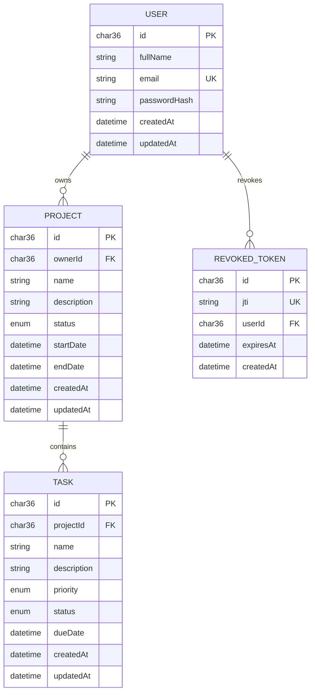

# Entity relationship diagram

Task ownership is derived through its project, so every task authorization
query is scoped through `Task.projectId -> Project.ownerId -> User.id`.
Projects cascade task deletion. Revoked tokens are retained only until their
JWT expiry.
